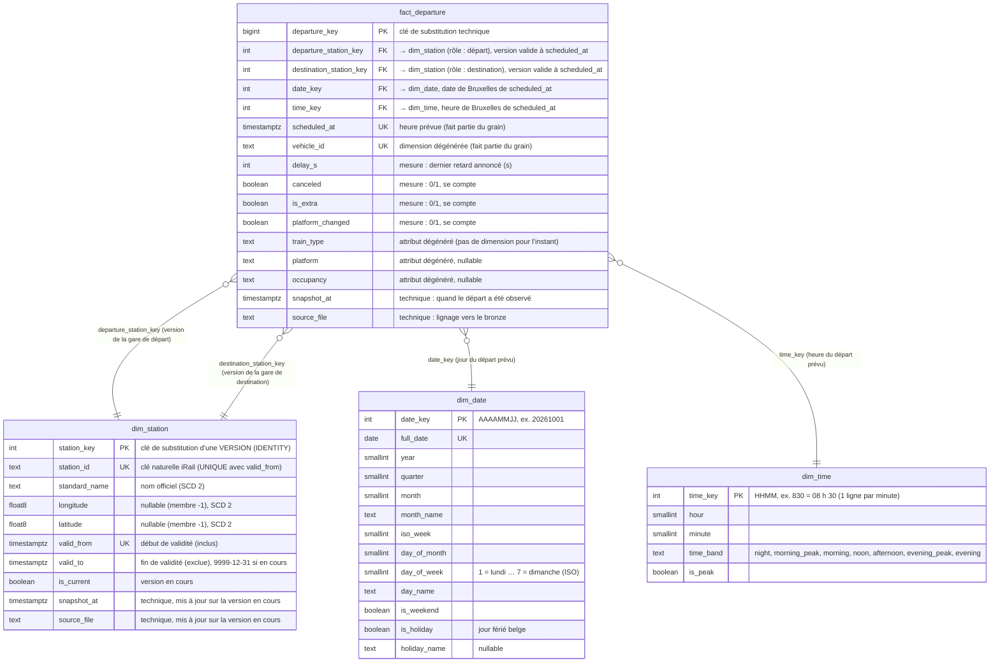

# Modèle en étoile — ponctualité SNCB

> Modèle dimensionnel (Kimball) de l'entrepôt PostgreSQL, construit à partir de la couche silver.
> Statut : chargé de bout en bout (`fact_departure`, `dim_station` en SCD 2, `dim_date`, `dim_time`). Reconstruction complète : `./scripts/rebuild_warehouse.sh`.

## Grain

**`fact_departure` : 1 ligne = 1 départ d'un train depuis une gare, à une heure prévue** (la dernière photo connue de ce départ).

## Diagramme

Lecture des liens : `}o--||` = **plusieurs** départs (zéro ou plus) pour **exactement une** gare / une date (relation N:1, typique entre une table de faits et une dimension).

## Décisions

1. **Le grain** est garanti par la contrainte **`UNIQUE (departure_station_key, scheduled_at, vehicle_id)`** : la même clé naturelle qu'en silver, exprimée avec la clé de substitution de la gare. `departure_key` est une clé primaire technique (convention Kimball) ; l'unicité métier vient du `UNIQUE`.
2. **Les clés étrangères sont des clés de substitution** (`…_station_key`, `date_key`), retrouvées **au chargement** par un *lookup* sur la clé naturelle (`station_id`). Les faits ne référencent jamais directement les identifiants iRail. Pour les gares, le lookup est **daté** (décision 9) : `station_id` **et** `scheduled_at >= valid_from AND scheduled_at < valid_to`.
3. **`dim_station` joue deux rôles** (dimension à rôles multiples) : une seule table, deux clés étrangères, deux jointures avec des alias.
4. **La date d'un départ vient de `scheduled_at`** (le jour où le train part), pas de `snapshot_at` (le jour où nous l'avons observé), **calculée dans le fuseau de Bruxelles** : on stocke l'instant en UTC, on dérive la date métier dans le fuseau du métier (`to_char(scheduled_at AT TIME ZONE 'Europe/Brussels', 'YYYYMMDD')::int`). Mesuré : 30 départs sur 2 843 changent de jour entre UTC et Bruxelles.
5. **`vehicle_id` est une dimension dégénérée pour l'instant** : il reste dans la table de faits et fait partie du grain, faute d'attributs à décrire aujourd'hui. **Évolution prévue** : quand les endpoints `vehicle` / `composition` d'iRail seront ingérés (relation de l'itinéraire, type de matériel…), on créera une `dim_vehicle` et la table de faits portera une `vehicle_key` (clé de substitution, retrouvée par lookup sur `vehicle_id`), comme pour les gares.
6. **`train_type`, `platform`, `occupancy` restent des attributs de la table de faits** (pas de dimension pour l'instant). Une `dim_train_type` pourra être ajoutée plus tard sans changer le grain.
7. **`snapshot_at` et `source_file` sont des colonnes techniques** (audit, lignage vers le bronze), pas des attributs métier.
8. **`dim_date`** : une ligne par jour, **du 01/01/2024 au 31/12/2030** (2 557 jours), remplie une fois pour toutes par upsert ; clé entière `AAAAMMJJ` (lisible, triable, compacte). Sa vraie valeur est ce qui ne se calcule pas : les **jours fériés belges** (bibliothèque `holidays`, version figée par `uv.lock`), puis les vacances scolaires. **`is_holiday` inclut les dimanches de Pâques et de Pentecôte** (la liste de la bibliothèque : 12 jours par an, 84 sur la période) ; pour comparer des jours ouvrables, filtrer aussi sur `is_weekend`.
9. **`dim_station` est en SCD 2** (historique complet, une ligne par version d'une gare) :
   - **ce qui crée une version** : un changement de `standard_name`, `longitude` ou `latitude` (tout est en type 2 : on fait confiance à l'API, une coordonnée qui change = une gare déplacée). `snapshot_at` et `source_file` sont **techniques** : mis à jour sur la version en cours, ils ne créent jamais de version ;
   - **les intervalles sont semi-ouverts** : `valid_from` inclus, `valid_to` exclu ; un instant appartient à exactement une version. La version en cours a `valid_to = '9999-12-31'` (pas de `NULL` : les comparaisons restent simples) et `is_current = true` ;
   - **la date de validité vient de `snapshot_at`** (la date d'observation) : la précision de l'historique est celle de la fréquence de collecte des gares. **La première version d'une gare commence au `1900-01-01`**, pour que tout départ trouve une version ;
   - **`station_key` identifie une version** : `UNIQUE (station_id, valid_from)` et `CHECK (valid_to > valid_from)` ;
   - **le chargement** (une transaction) : staging `stg_station` → ① fermeture des versions en cours qui ont changé (`UPDATE … FROM`) → ② `MERGE` (`MATCHED` : mise à jour du lignage ; `NOT MATCHED` : nouvelle version, `valid_from` = `1900-01-01` pour une gare nouvelle, `snapshot_at` sinon). L'ordre ① puis ② est obligatoire : c'est la fermeture qui envoie une gare modifiée dans le cas `NOT MATCHED` ;
   - **charger les dimensions avant les faits.** Un changement **antidaté** (une version qui commence avant des faits déjà chargés) oblige à **retraiter** les faits de la période : sinon l'upsert crée un doublon (même départ, deux versions de sa gare), que la contrainte `UNIQUE` ne voit pas et que le contrôle C10 détecte ;
   - les contrôles C7 à C10 (`sql/quality_checks.sql`) vérifient : une seule version en cours par gare, ni trou ni chevauchement (`LEAD`), aucun intervalle vide ou inversé, le grain à travers les versions.
10. **Le chargement ne supprime rien** : il est idempotent pour les lignes qu'il charge, mais ne nettoie pas celles qu'il ne charge plus (voulu pour `dim_station` : une gare disparue d'iRail garde sa dernière version, et ses anciens départs).
11. **Le membre « gare inconnue » (`station_key = -1`)** existe dans `dim_station`, avec des coordonnées `NULL` et une validité de `1900-01-01` à `9999-12-31`. Un départ dont la gare (départ ou destination) est absente de la dimension est **chargé quand même** avec la clé `-1` : le pipeline ne s'arrête pas, aucun fait n'est perdu, la clé étrangère est respectée. Le chargement **logue clairement** (niveau `WARNING`) le nombre de faits rattachés au `-1` et les `station_id` concernés, pour les traiter plus tard (relancer `irail-stations`, puis recharger). Un contrôle qualité les compte (bloc D).
12. **`dim_time`** est ajoutée dès maintenant pour l'analyse par tranche horaire ; la clé est calculée, comme la date, **dans le fuseau de Bruxelles** à partir de `scheduled_at`. **Grain atomique : une ligne par minute** (1 440 lignes), clé `time_key = heure × 100 + minute` (`830` = 08 h 30). La règle des tranches est **définie par la fonction `time_band` de `calendar_dim.py`** (source de vérité), en intervalles `[début, fin)` : `night` 0–6 h · `morning_peak` 6–9 h · `morning` 9–12 h · `noon` 12–14 h · `afternoon` 14–17 h · `evening_peak` 17–20 h · `evening` 20–24 h ; `is_peak` = les deux pointes.
